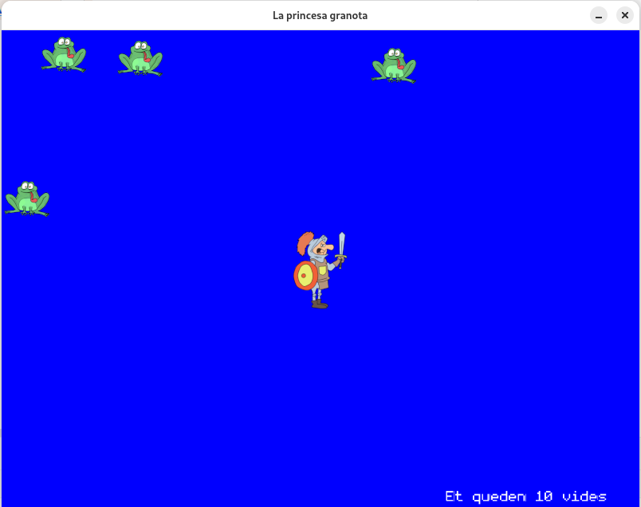

# Cavaller

Exemple fet a classe amb la llibreria de C#, [Heirloom](https://github.com/Chamberlain91/Heirloom), que ha de permetre que un cavaller es mogui per la pantalla.

O no ... 

La idea és que capturi la granota que en realitat és una princesa abans
que la pantalla quedi completament plena ...

Cada vegada que falla apareix una nova granota

I quan la troba tot són roses i violes (o no era així?)

